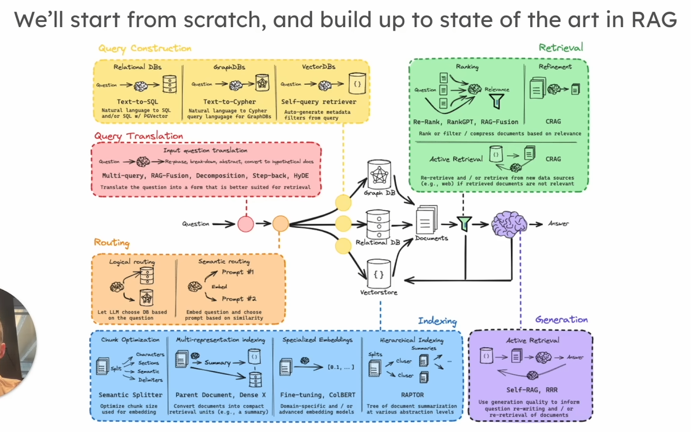
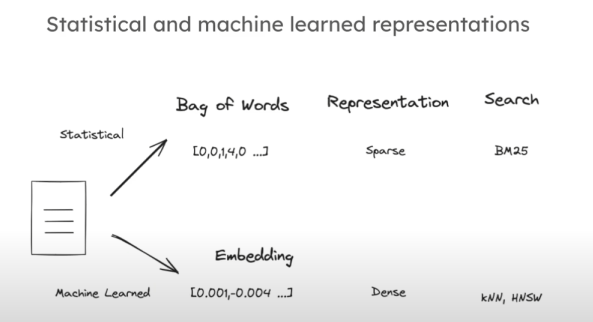

# Idea

Feed custom data to LLMs

Question -> Indexing documents -> Retrieval Document -> Generation

Query Construction
Query Translation
Routing
Indexing
Retrieval
Generation

## Basics

* Indexing
* Retrieval
* Generation

## Advanced

* Query transformation
* Routing
* Query Construction
* Indexing
* Retrieval
* Generation

## Indexing

